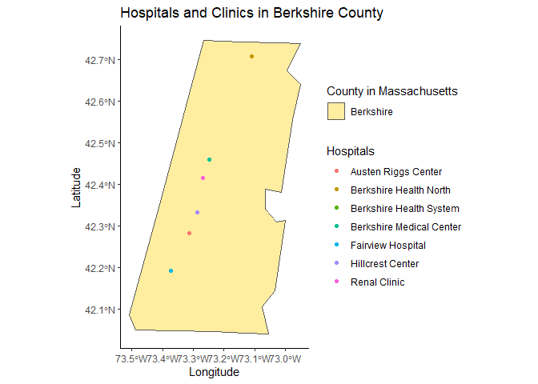

HOSPITALS AND CLINICS IN BERKSHIRE COUNTY MA
================

## **Hospitals and Clinics Brief Despcriptions**

-   The Austen Riggs Center is a psychiatric treatment facility in
    Stockbridge, Massachusetts.
-   Berkshire Health North provides 24-hour emergency care, a wide range
    of outpatient clinical and diagnostic services, outpatient surgery,
    and specialized health and wellness programs.
-   Berkshire Health Systems is the premier provider of comprehensive
    health services in the Berkshires and surrounding area.
-   Berkshire Medical Center is a 298-bed community teaching hospital
    and the recipient of numerous national recognitions for service
    excellence and patient safety.
-   Fairview is a primary acute care hospital offering inpatient medical
    services, general surgery, orthopedics, and maternity services with
    24-hour emergency and hospitalist coverage.
-   Hillcrest Center Hillcrest Center in Lenox specializes in the
    treatment of adolescent girls with severe psychiatric, emotional and
    behavior disorders.
-   Renal Clinic, BMC Central County Dialysis Center provides
    state-of-the-art care for over 100 patients in the Pittsfield area.

------------------------------------------------------------------------

## *Data Code*

*Data Manipulation*

``` r
# Load Data for MA boundries 
MA_counties <- USAboundaries::us_counties(resolution = "low", states = c("massachusetts")) %>%   select(-state_name) %>% 
  filter(name== "Berkshire")

# Load Data for Hospitals
hospitals_locations <- "Data/Berkshires_hospitals.csv " %>% 
  read_sf() %>% 
  st_as_sf(coords = c("lon", "lat"), crs = 4326)
```

------------------------------------------------------------------------

### *Plot*

*Visualization of hospitals and clinics locations in Berkshire County
MA.*

<!-- -->
